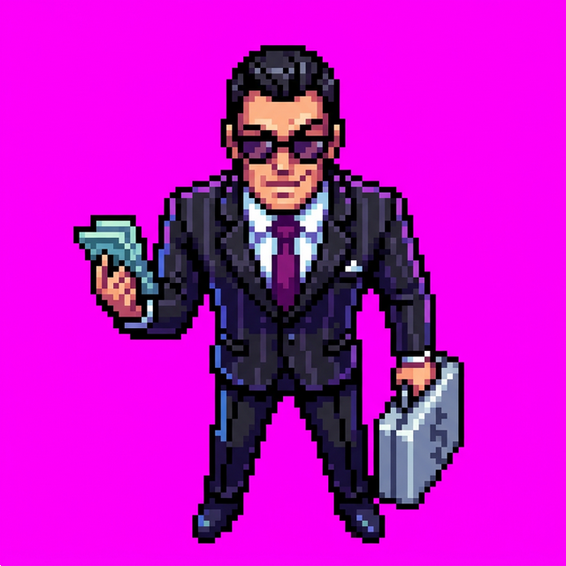
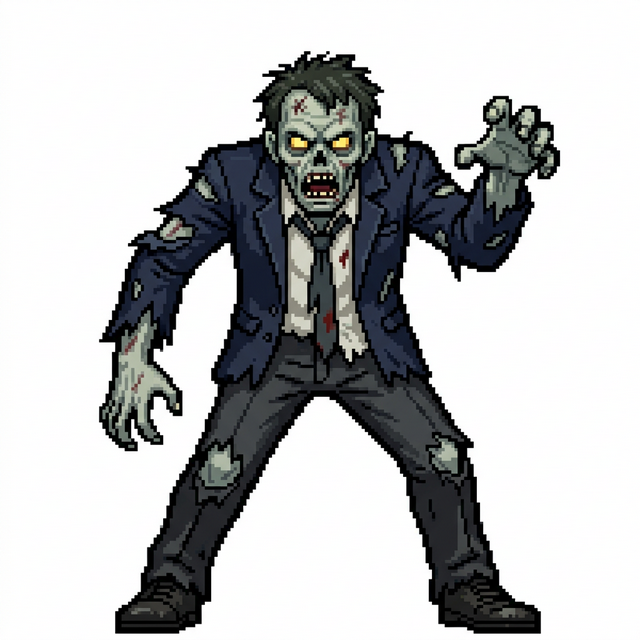
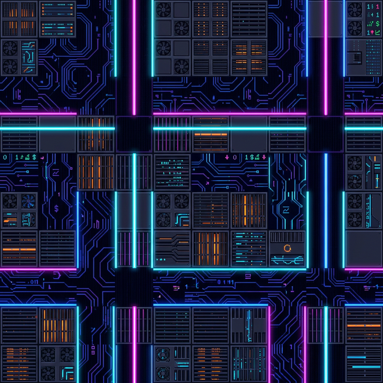
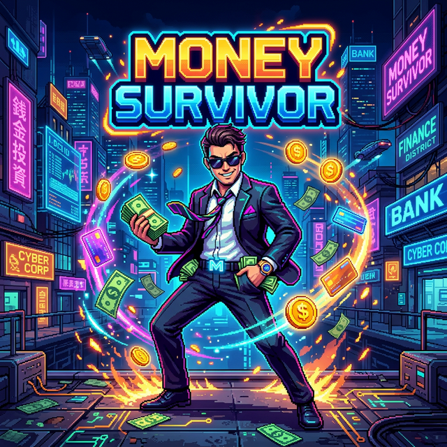
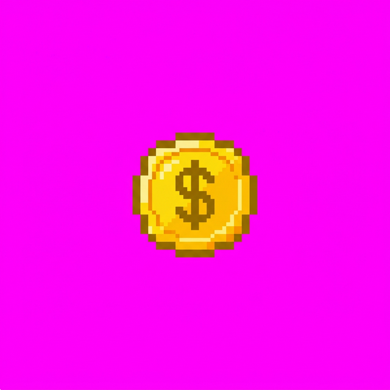
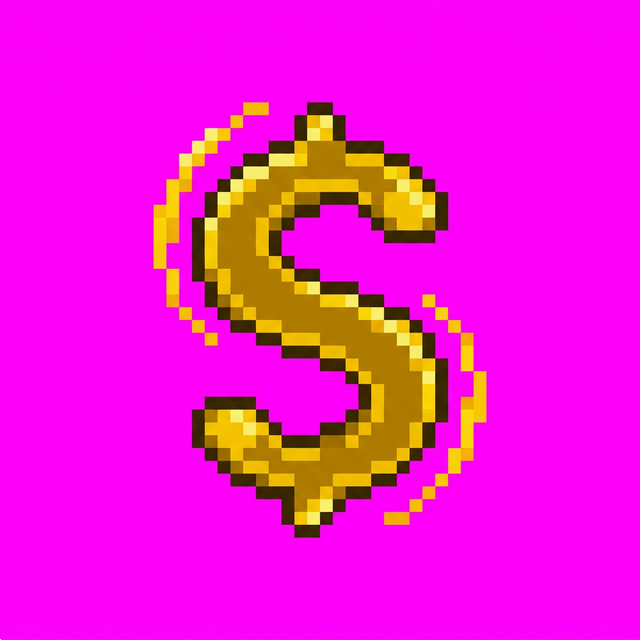
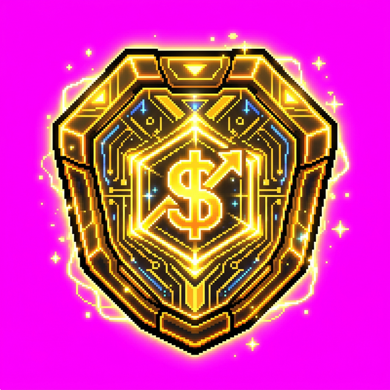

# Money Survivor 💸

**Money Survivor** is a fast-paced, top-down action roguelike ("bullet heaven") built entirely in Unity, themed around surviving a cyberpunk financial apocalypse. Play as a slick corporate CEO, use financially-themed weapons to fight off hordes of corrupt bankers and auditors, and maximize your Net Worth!

## 🤖 Built with Google Antigravity
This entire game—including core gameplay loops, enemy AI, a complete weapon upgrade system, dynamic UI, and the pixel art assets themselves—was built through pair programming and prompt-driven development using **Google Antigravity**. 

The project structure is fundamentally unique: It avoids messy, unmergable Unity scenes and prefab metadata by using a custom **Editor Setup Script** (`GameSetup.cs`). 
By simply running a single menu command (`MoneySurvivor → Setup Entire Project`), the AI's code dynamically generates all GameObjects, assigns all script logic, builds the necessary prefabs, bakes the scenes, and creates the ScriptableObjects that run the game database.

---

## 📸 Screenshots & Artwork

A showcase of the AI-generated pixel art assets that give the game its juicy, synthwave-finance aesthetic.

### The CEO
The player character. A stylized banker in a sharp suit and sunglasses.

### The Opposition
Hordes of enemies representing the corrupted factions of the financial world (Bankmen, Loan Sharks, Tax Collectors, Auditors).

### The Corporate Floor
A seamlessly tileable cyberpunk neon financial company office floor, featuring glowing lines and data server tiles.

### Splash Screen & Main Menu

---

## ⚔️ Wealth Acquisition (Weapons)
Expand your portfolio by leveling up to get new items.

* **Single Shot:** Reliable initial investment. Fires a high-speed projectile at the nearest enemy.
* **Coin Toss:** Throw heavy, physics-enabled coins into the fray that deal collateral damage.
   
* **Boomerang Card:** Fling a heavy credit card that slices through enemies, stops, and returns to your hand.
   
* **Bill Whip:** Sweep a massive arc of dollar bills in the direction you are moving to clear space.
* **Compound Interest:** A persistent aura of damaging energy surrounding the player.
* **Dividend Shield:** Equip floating geometric neon shields that orbit around you, damaging any enemies that try to crash the market.
   

## 📈 Mechanics & Systems

* **Dynamic Scaling:** As time Surviving increases, enemy spawn rates dramatically increase.
* **Event Bus Architecture:** An elegant, decoupled event-driven system handles game state changes, leveling up, and UI updates without hard dependencies.
* **Object Pooling:** To maintain smooth 60fps+ gameplay during the most intense swarm moments, all enemies and particles use memory-efficient object pooling.
* **Juicy Combat:** Advanced visual feedback including Hit Flashing, screen shakes, floating XP orbs, and rich particle emitters on enemy death.
* **Event-Driven UI:** Custom, stylized HUD and floating menus drawn cleanly with `OnGUI`.

## 🚀 How to Play (Developer Setup)

1. Clone or download the repository to an empty Unity Project.
2. Open the Unity Editor.
3. In the top Menu Bar, click **`MoneySurvivor → Setup Entire Project`**.
4. The custom editor scripts will run, automatically generating every Prefab, Sprite, ScriptableObject, and Scene.
5. Open `Assets/Scenes/MainMenu.unity` and press **Play**!
