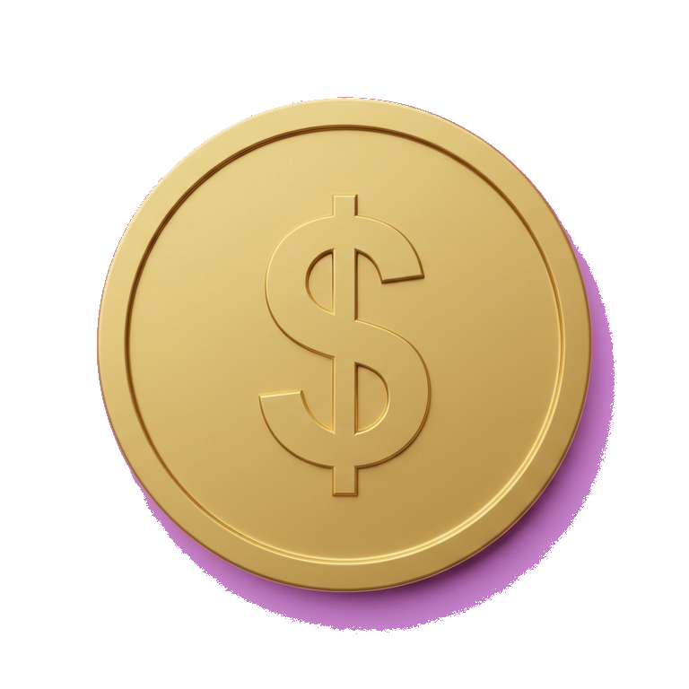
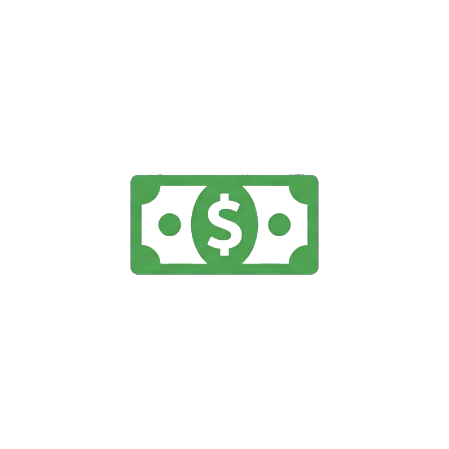
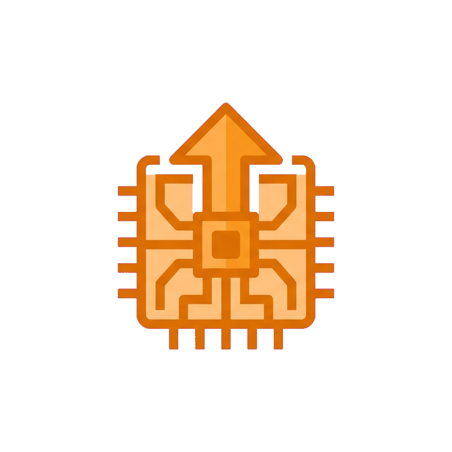

# Money Survivor 💸

**Money Survivor** is a fast-paced, top-down action roguelike ("bullet heaven") built entirely in Unity, themed around surviving a cyberpunk financial apocalypse. Play as a slick corporate CEO, use financially-themed weapons to fight off hordes of corrupt bankers and auditors, and maximize your Net Worth!

## 🤖 Built with AI Pair Programming
This entire game—including core gameplay loops, enemy AI, a complete weapon upgrade system, dynamic UI, office environments, and the pixel art assets themselves—was built through pair programming and prompt-driven development.

### 📚 Development History & Documentation
For full transparency and to document the AI pair-programming process, the complete history and architecture have been preserved:
- [Prompt History](prompt_history.md) – A full log of the exact user prompts used to build the game.
- [Implementation Plan](implementation_plan.md) – The core software architecture and engine decisions.
- [Development Walkthrough](walkthrough.md) – A step-by-step narrative of the problems encountered and solved during development.

The project structure is fundamentally unique: It avoids messy, unmergable Unity scenes and prefab metadata by using a custom **Editor Setup Script** (`GameSetup.cs`). By simply running a single menu command (**MoneySurvivor → Setup Entire Project**), the script dynamically generates all GameObjects, assigns all script logic, builds the necessary prefabs, bakes the scenes, and creates the ScriptableObjects that run the game database.

---

## ⚔️ Weapons (Wealth Acquisition)
Expand your portfolio by leveling up to get new items. You can hold **at most 3 weapons**; each weapon can be upgraded up to **level 10**. Weapon icons appear in the HUD thumbnails and on level-up cards.

| Icon | Weapon | Description |
|------|--------|-------------|
|  | **Aimed Bullet** | Fires a high-speed projectile directly at the nearest enemy. Reliable single-target DPS. |
|  | **Coin Toss** | Throws gold coins in all directions that deal damage and pierce. Overkill-style spread. |
|  | **Bill Whip** | Sweeps a massive arc of dollar bills to hit all nearby enemies in range. |
|  | **Compound Interest** | A persistent aura around the player that damages and lightly pushes nearby enemies. Grows with level. |
|  | **Credit Card** | Throws a piercing credit card that boomerangs back. High pierce, multiple cards at higher levels. |
|  | **Cryptominer** | Drops stationary mining rigs that burn enemies in an area over time. |
|  | **Stock Options** | Shoots volatile market arrows; damage randomizes significantly per hit. |

All weapon icons use a **consistent square format** and **mauve (#E0B0FF) background** that is stripped to transparency at import (same approach as the XP orb). Icons are stored in `Assets/Art/WeaponIcons/` and are assigned when you run **MoneySurvivor → Setup Entire Project** or **Assign Weapon Icons**.

## 👹 Enemies & Bosses
| Type | Role | Notes |
|------|------|--------|
| **Bankman** | Basic | Low HP, moderate speed. |
| **ExWife** | Mid | Higher HP and damage. |
| **Children** | Swarm | Fast, low HP. |
| **Bouncer** | Tank | Slow, high HP. |
| **IRS** | Boss | Spawns every 3 min. Large (1.8× scale), 600 HP, 55 contact damage, 120 XP. Drops chest. |
| **CEO** | Boss | Spawns at 10 min. Very large (4× scale), 6000 HP, 70 contact damage, 1200 XP. Drops chest. |
| **MegaBoss** | Boss | Spawns every 2 min. Huge (5.6× scale), 1500 HP, 90 contact damage, 700 XP, red aura particles. Drops chest. |

## 🎁 Power-Ups (Chests & Level-Up)
- **Heal** / **Max HP** / **Speed** / **Damage** / **Pickup Radius** – Stat boosts.
- **Restraining Order** – Weapons push enemies further away.
- **Insider Trading** – +50% XP from orbs.
- **Tax Evasion** – Longer invincibility after taking damage.
- **Overclock** – Multiplier to projectile count (weapons fire more projectiles per shot).

---

## 📐 Rules & Mechanics

- **Movement bounds:** Player cannot leave the play area; position is clamped to ±95 units so you stay on the background.
- **Obstacles:** Office furniture (desks, chairs, walls) is placed randomly; player and enemies cannot walk through them (insurmountable, blocking colliders).
- **Foreground sync:** The tiled foreground background scrolls with the camera; obstacles, XP orbs, and crypto miner rigs move with it so they don’t slide on the ground.
- **Score:** Net Worth = number of enemies killed (no time-based score).
- **Difficulty:** Spawn rate and enemy mix escalate every 30 s (tier). **Bosses:** IRS every 3 min, MegaBoss every 2 min, CEO once at 10 min. **After 15 min:** IRS every 1.5 min, MegaBoss every 1 min. **After 20 min:** IRS and MegaBoss every 10 s. **After 22 min:** spawn rate becomes **insane** (very fast regular spawns).

---

## 📸 Screenshots & Artwork

A showcase of the AI-generated pixel art and procedural assets.

### The CEO
The player character. A stylized banker in a sharp suit and sunglasses.

### The Opposition
Hordes of enemies representing the corrupted factions of the financial world (Bankmen, Ex-Wife, Children, Bouncers, IRS, CEO, MegaBoss).

### The Corporate Floor
- **Foreground:** Lighter tiled pattern with rectangular “glass” windows (striped blue) revealing the layer below.
- **Underneath:** Blue sky with clouds; both layers use parallax scrolling.

### Splash Screen & Main Menu
Custom splash and menus themed to the game.

---

## 📈 Systems

- **Dynamic scaling:** As time survived increases, spawn rate and difficulty tier increase.
- **Event bus:** Decoupled events for game state, level-up, and UI.
- **Object pooling:** Enemies and particles use pooling for performance.
- **Juicy combat:** Hit flashing, screen shake, XP orbs, particle emitters on hit/death.
- **OnGUI UI:** HUD, pause menu, level-up cards, and game-over screen drawn with OnGUI.

---

## 🚀 How to Play (Developer Setup)

1. Clone or download the repository into a Unity project.
2. Open the Unity Editor.
3. In the menu bar, click **MoneySurvivor → Setup Entire Project**.
4. The editor script will generate Prefabs, Sprites, ScriptableObjects, and Scenes.
5. Open **Assets/Scenes/MainMenu.unity** (or **Game.unity**) and press **Play**.
